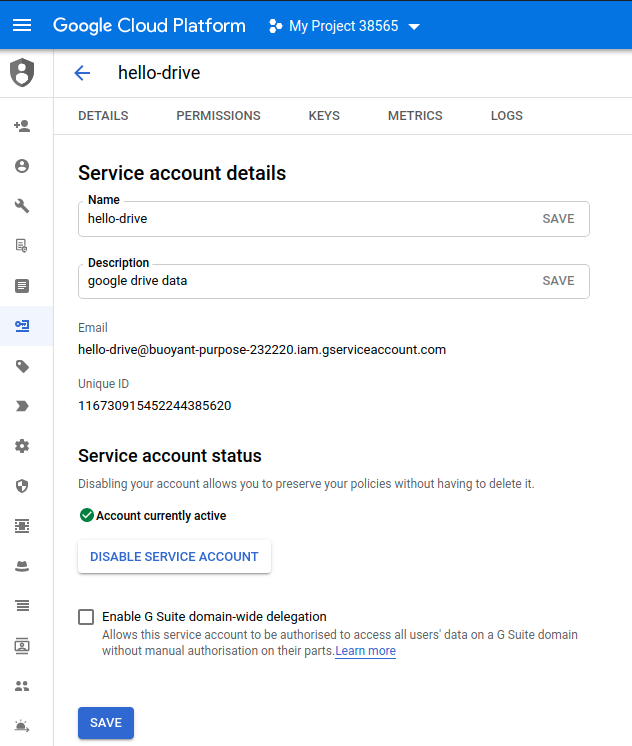

```{r setup, include=FALSE}
knitr::opts_chunk$set(echo = TRUE)
init_time <- Sys.time()
googledrive::drive_auth(path = ".buoyant-purpose-232220-c0625ed45e4f.json")
```

## Setting the Environment

The task has the specification to develop the solution in shiny using shiny.semntic 4.0.0. 
We will use, data.table for data I/O and data wrangling since it excells on speed and and memory footrint (see the automated benchmarks from [H2O](https://h2oai.github.io/db-benchmark/).

```{r}
library(data.table, warn.conflicts = FALSE)
library(magrittr) 
library(googledrive)
library(ggplot2)
library(fst)
library(geodist)
```

## Exploratory data analysis

In this section we download data with a non-interactive authorization retaining a controled access to the google drive repo and ensuring reproducibility throughout the process. Then the data are loaded for Exploratory Data Analysis.

Calculations are performed with assignment by reference using the `:=` operator 
of the data.table extension to data.frame. We will use this technique extensively 
during most of the computations due to its optimized performance since it performs 
minimal copies on memory. Also, data wrangling is performed within the data.table 
environment to take advantage of the optimised backend. We carefully use vectorised 
operations avoiding for loops. This, is an essential technique in high-level 
programming languages since reduces function which are costly.

## Download Data

We will setup a process that requires no user interaction. This process ensures reproducibility as the document will render with no intervention and is key to maintainability, continues integration, development and testing. Also we will get familiarized with integrating Google Cloud Services with data pipelines using a service account.

To ensure no human involvement the most appropriate token to use is the **service account token**. Boldly speaking there are two steps involved in the process,

Step 1: Get a service account and then download a token in json format.

Step 2: Call the auth function proactively and provide the path to your service account token.

Concerning the first step a google account is needed. The definition can be done through the Google Cloud Platform project (see Documentation). The process is as follows:

1) Navigate from the Developers Console to your service account.

2) Follow the steps to define the service account.

Do Create key and download as JSON. This is the service account token.

Through the service account, the computing session has limited visibility to google drive. Only files shared with the service account can be accessed. Since I'm not an owner of the shared dataset I created a copy on my drive and shared via the email of the service account.

Notice: In a CI/CD case where the process is committed and pushed the .json should be encrypted.

In the following screen shot is the definition of the service account. The developer should further define that is for google drive API usage.



```{r}
dir.create("dataset/", showWarnings = FALSE)
options(gargle_oauth_email = TRUE)
drive_download("ships_04112020.zip", path = "dataset/ships.zip", overwrite = TRUE)
```

## Load Data

- Unzip data and report file size

```{r}
ships_dt <- fread('unzip -p dataset/ships.zip', stringsAsFactors = TRUE)
str(ships_dt)
```

We observe that the dataset is relatively "healthy". There are some missing values,
while the column names are descriptive. There are ~3 Million observations. 


## Tidy data

We remove rows with `NA` value for `LON` and `LAT`

```{r}
nrow_init <- ships_dt %>% nrow
ships_dt <- ships_dt[!is.na(LAT)][!is.na(LON)]
```

- `NA` Rows removed: **`r nrow_init - ships_dt %>% nrow`**

We can bring the data in a more "tidy" format by extracting a vessels table. In that
sense each row is an observation and each column in a variable while each type of 
observational unit is a table (a ports table is also possible to be extracted but we left 
for future work). 

In the vessels table we will store invariant columns with respect to geolocation 
and time. 

```{r}
vessel_vars <- c("SHIPNAME", "LENGTH", "SHIPTYPE", "WIDTH", "FLAG", "ship_type")
vessels_dt <- ships_dt[, c("SHIP_ID", vessel_vars), with = FALSE] %>%
  unique
```

- Discarding vars from AIS table

```{r}
ships_dt <- ships_dt[, -vessel_vars, with = FALSE]
```

- SHIP_ID should be unique in vessels table. However, this is not the case.

Inspecting cases,

```{r}
dup_ids <- vessels_dt[, table(SHIP_ID) > 1] %>%
  which %>%
  names %>% 
  as.integer

vessels_dt[SHIP_ID %in% dup_ids][order(SHIP_ID)] %>%
  head
```

There is some noise in the data and vessels look very similar for each duplicated id.

- *Thus, we keep the first observation for each vessel id.*

```{r}
vessels_dt <- vessels_dt[, head(.SD, 1), by = "SHIP_ID"]
testthat::expect_false(any(vessels_dt[, table(SHIP_ID) > 1]))
```

- Also name `[SAT-AIS]` looks like a discrepancy in the data so we remove it

```{r}
vessels_dt <- vessels_dt[SHIPNAME != "[SAT-AIS]"]
vessels_dt %>%
  head
```

## Longest distance calculation

- Pre-compute for each vessel the longest distance traveled between two consecutive 
observations.

- Sort with respect to `SHIP_ID` and `DATETIME`. 
- Take the lag vectors for `LAT` and `LON`.
- Calculate Karney distance between LON, LAT and their respective lag vectors 
(accuracy ~ 1mm).
- Get max value(s) for each `SHIP_ID`.
- Get latest max value to cover the edge case of a vessel moving exactly the same 
amount of meters.

```{r}
ships_dt <- ships_dt[order(SHIP_ID, DATETIME)]
ships_dt[, `:=`(fromLAT = shift(LAT), fromLON = shift(LON), fromTIME = shift(DATETIME)), by = "SHIP_ID"]
```

For geodistance calculation we will use the lightweight and efficient `geodist` library and we will use Karney distance ("Algorithms for geodesics" J Geod 87:43-55) since it is accurate
and for large distances.

```{r}
ships_dt[, DIST := geodist(cbind(LON, LAT), cbind(fromLON, fromLAT), paired = TRUE, measure = "geodesic")]

ships_dt[, DIST := round(DIST, 3)] #karney distance has accuracy less than 1mm!

ships_long_dist <- ships_dt[
  !is.na(DIST)][
    order(SHIP_ID, DATETIME, DIST)][
      , tail(.SD, 1), by = "SHIP_ID"]
```

- Merging with vessels data keeping all vessel ids even if a max distance is not
retrieved.

```{r, out.width = "100%"}
vessels_dt <- merge(vessels_dt, ships_long_dist, on = "SHIP_ID", all.x = TRUE)
```

- Calculating time difference between two consecutive observations,

```{r}
vessels_dt[, delta_tau := DATETIME - fromTIME]
```

## Last Location

If no vessel is selected in the app then display all vessels with respect to 
their latest location.

```{r}
last_signal <- 
  ships_dt[order(-DATETIME, SHIP_ID), head(.SD, 1), by = "SHIP_ID", .SDcols = c("LAT", "LON")]
setnames(last_signal, c("LON", "LAT"), c("lastLON", "lastLAT"))

vessels_dt <- merge(vessels_dt, last_signal, all.x = TRUE)
```

## Tidying vessels data

Cleaning step to prepare data for shiny.

### Missing location

For some vessels we get only one observation. This will cause a *discrepancy*
for displaying consecutive distances. 

Although they are treated by the shiny server function, we remove them proactively.

```{r}
vessels_dt <- vessels_dt[!is.na(LAT) | is.na(LON)]
```

## Preparing timeseries data

Data for plotly visualization. 

- Calculate mean distance between concurrent observations by `vessel type` and `date`. 

```{r}
ts_data <- merge(
  ships_dt[!is.na(DIST), .(date, SHIP_ID, DIST)], 
  vessels_dt[, .(SHIP_ID, SHIPTYPE, ship_type)],
  by = "SHIP_ID"
)
ts_data <- ts_data[, .(date_dist = mean(DIST)), by = c("date", "SHIPTYPE", "ship_type")]
```

## Vessels Data

Exposed data are easier to inspect and helps in the development process and debugging of the app later on.

```{r}
DT::datatable(
  vessels_dt,
  extensions = 'Buttons',
  options = list(
    scrollX = TRUE,
    dom = 'Bfrtip',
    buttons = c('copy', 'csv', 'excel', 'pdf', 'print')
  )
)
```

## Timeseries Data

```{r}
DT::datatable(
  ts_data,
  extensions = 'Buttons',
  options = list(
    scrollX = TRUE,
    dom = 'Bfrtip',
    buttons = c('copy', 'csv', 'excel', 'pdf', 'print')
  )
)
```


## Save data

### Vessels data

```{r}
fwrite(vessels_dt, "vessels.csv")
```

- Dimensions: **`r dim(vessels_dt)`**
- File size: **`r file.info("vessels.csv")$size %>% utils:::format.object_size("auto")`**

### Timeseries data

```{r}
fwrite(ts_data, "ts_data.csv")
```

- Dimensions: **`r dim(ts_data)`**
- File size: **`r file.info("ts_data.csv")$size %>% utils:::format.object_size("auto")`**

### Saving current unix time for [reactive polling](https://shiny.rstudio.com/reference/shiny/latest/reactivePoll.html)

```{r}
Sys.time() %>%
  as.numeric %>%
  as.character %>%
  writeLines("timestamp.txt")
```

## Linked data 

- **Vessels: [vessels.csv](vessels.csv)**

- **Timeseries: [ts_data.csv](ts_data.csv)**

- **Unix Time: [timestamp.txt](timestamp.txt)**


## Total time

Report's render time: **`r round(Sys.time() - init_time)` sec**

## Session Info

```{r}
sessionInfo()
```
